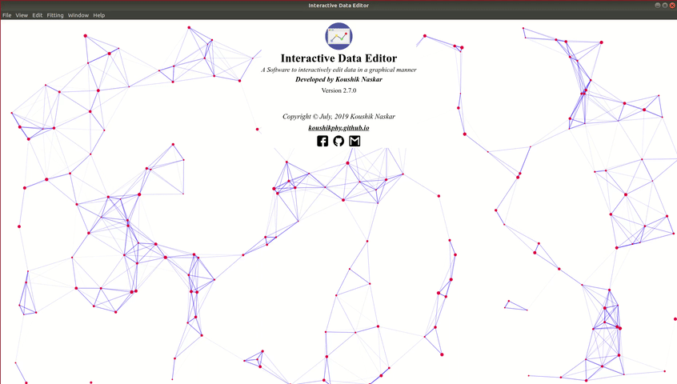

<head>
    
</head>

    
Interactive Data Editor

    
A Software to interactively  edit data in a graphical manner.
 
    
    <!-- <video loop auyoplay><source src="../videos/ide/start_screen.mp4" type="video/mp4"></video> -->

We have all worked with data at some point of our work. Now, depending on the source, sometimes the data may not be regular,
smooth and uniform and requires refinement before applying for any practical use. This software lets you do that very easily and 
efficiently in a graphical way including many others useful data operation. 
Using Interactive Data Editor one can  

    1. Plot any 2D and gridded 3D data. 
    2. Edit/Refine data including many useful data operations. 
    3. Fit a function to the data. 

The software is available as pre-built binaries for different platforms. Install the appropriate installer for your system 
and load your data to get started.

## Main Features

    1. Edit one or multiple points by dragging with mouse and keyboard keys. 
    2. Automatically smooth data using spline and linear Kernel smoother. 
    3. Fit any function to the data.  
    4. Plot any 2D and gridded 3D data with LaTeX rendering support. 
    5. Export images in five format in any resolution. 
    6. Simultaneously work with multiple datasets. 
    7. Fill missing values. 
    8. Remove bad data points. 
    9. Repeat or mirror data any required times. 
    10. Filter data subject to a given condition. 
    11. Swap data between two lines or surfaces. 
    12. Supports undo/redo. 
    13. Change sign of any selected part of the data. 
    14. Spreadsheet editor with all basic excel like features including formula parsing. 
    &ensp;And many more...

## Gallery

    <a href="../posts/gallery.html">Check out the software in action.</a>

## Changelog

    <a href="https://github.com/Koushikphy/Interactive-Data-Editor/releases">Changelog and older versions.</a>

## Download & Installation

Download the latest version of the sofware appropriate for your system from the links below. Windows
users
download the msi or exe installer. If you are on any Linux distro, download the AppImage,
make it executable and run it, no installation required. Ubuntu/Debian users can install the debian installer
too.

    <b>Windows</b>(<a
        href='https://github.com/Koushikphy/Interactive-Data-Editor/releases/download/v2.7.0/Interactive.Data.Editor.2.7.0.exe'>.exe</a>,
    <a
        href='https://github.com/Koushikphy/Interactive-Data-Editor/releases/download/v2.7.0/Interactive.Data.Editor.2.7.0.msi'>.msi</a>
    ) 
    <b>Linux</b> &ensp;&ensp;(<a
        href='https://github.com/Koushikphy/Interactive-Data-Editor/releases/download/v2.7.0/Interactive.Data.Editor.2.7.0.AppImage'>.AppImage</a>,
    <a
        href='https://github.com/Koushikphy/Interactive-Data-Editor/releases/download/v2.7.0/interactive_data_editor_2.7.0_amd64.deb'>.deb</a>)
     

## Feedback

    I would really like to hear your experience of using this software. Found a bug or want a new
    feature to
    include! Just open a new <a href='https://github.com/Koushikphy/Interactive-Data-Editor/issues'>issue</a> on
    github or contact the author directly at <a href='https://www.facebook.com/koushik.naskar3'>facebook</a> or
    <a href='mailto:koushik.naskar9@gmail.com'>gmail</a>.

## Copyright and license

    Copyright &copy; November 2019, Koushik Naskar. All rights reserved. 

Licensed under the <a
    href='https://github.com/Koushikphy/Interactive-Data-Editor/blob/master/LICENSE'>MIT</a>
License.

