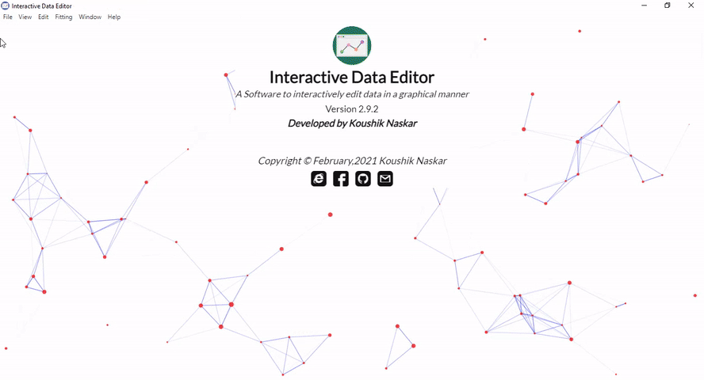

<head>
    
</head>

    
Interactive Data Editor

    
A Software to interactively  edit data in a graphical manner.
 
    

We have all worked with data at some point of time. Now, depending on the source, sometimes the data may not be regular, smooth and uniform and requires refinement before applying for any practical use. This software lets you do that very easily and efficiently in a graphical way including many others useful data operation.
Using Interactive Data Editor one can  

    1. Plot any 2D and gridded 3D data. 
    2. Edit/Refine data including many useful data operations. 
    3. Fit a function to the data. 

The software is available as pre-built binaries for different platforms. Install the appropriate installer for your system 
and load your data to get started.

## Main Features

    1. Edit one or multiple points by dragging with mouse and keyboard keys. 
    2. Automatically smooth data using spline and linear Kernel smoother. 
    3. Fit any function to the data.  
    4. Plot any 2D and gridded 3D data with LaTeX rendering support. 
    5. Export images in five format in any resolution. 
    6. Simultaneously work with multiple datasets. 
    7. Fill missing values. 
    8. Remove bad data points. 
    9. Repeat or mirror data any required times. 
    10. Filter data subject to a given condition. 
    11. Swap data between two lines or surfaces. 
    12. Supports undo/redo. 
    13. Change sign of any selected part of the data. 
    14. Spreadsheet editor with all basic excel like features including formula parsing. 
    &ensp;And many more...

## Quick reference

    <a href="../posts/ide_quick_ref.html">Check for quick reference and documentation.</a>

## Changelog

    <a href="https://github.com/Koushikphy/Interactive_Data_Editor/blob/master/RELEASE.md">Changelog and older versions.</a>

## Download & Installation

The software is available as pre-built binaries for different platforms. Install the appropriate installer for your system available in releases section of this repo.

    <b><a href='https://github.com/Koushikphy/Interactive_Data_Editor/releases/latest'>Download the latest version</a></b>
     

## Project Homepage  
Check out the <a href="https://github.com/Koushikphy/Interactive_Data_Editor"> project homepage </a> for the latest development of the project or to contribute.

## Feedback

    I would really like to hear your experience of using this software. Found a bug or want a new feature to include! Just open a new <a href='https://github.com/Koushikphy/Interactive_Data_Editor/issues'>issue</a> on github or contact the author directly at <a href='https://www.facebook.com/koushik.naskar3'>facebook</a> or <a href='mailto:koushik.naskar9@gmail.com'>gmail</a>.

## Copyright and license

Copyright © July 2020, Koushik Naskar. All rights reserved.
Licensed under the <a href='https://github.com/Koushikphy/Interactive_Data_Editor/blob/master/LICENSE'>MIT</a> License.  

## Citaion

If this software was helpful in your work, please cite this project as <a href='https://doi.org/10.5281/zenodo.3947508'>https://doi.org/10.5281/zenodo.3947508</a>

