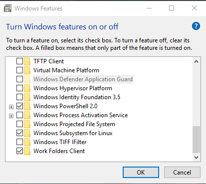
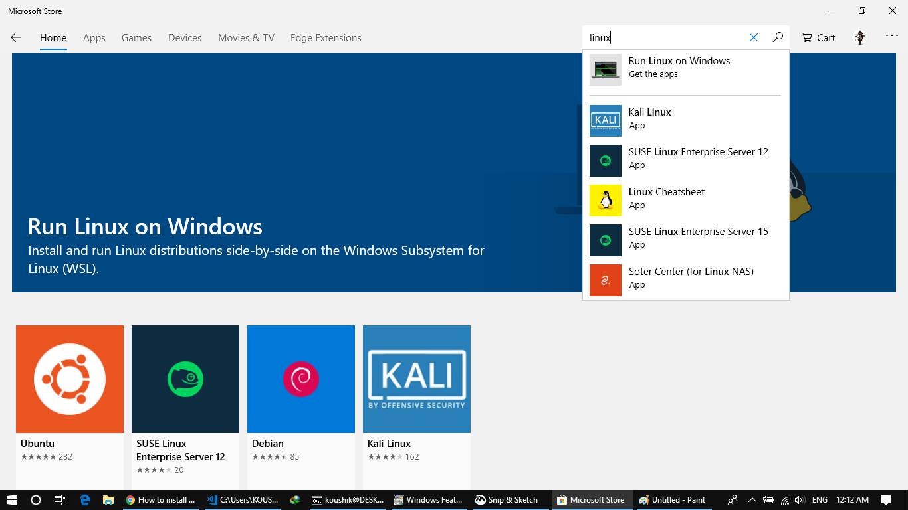

If you, need both Windows and Linux in our day to day life, there's a high chance that you have both installed in your system as dual boot. Though this works, you can't use them simultaneously or move between Windows and Linux on the go, including you can't access files of one OS from the other easily. Windows 10 solves this problem by  bringing Windows Subsystem For Linux. Though it sounds like a virtual machine for linux running in windows, it's not. It's compatability layer for linux which is faster, lighter and easier to work than a virtual box. 


## Setting up WSL
### Step 1. Activate WSL
First and foremost you must be using Windows 10 version 1607 or above to use WSL. WSL is not active by default in Windows 10. To activate search for `Turn Windows features on or off` in windows search bar and check `Windows Subsystem for Linux`.   
  
Now, restart your system.

### Step 2. Installing Linux
Go to Microsoft store and search for `linux` and select `Run Linux on Windows` or just go to this link [https://aka.ms/wslstore](https://aka.ms/wslstore). Now install a linux distro of your choice (e.g. ubuntu).  
  

After store finishes installing search and open `Bash` from windows search bar. First time you open, it will set up linux on your system and asks you to provide a new username and password for WSL. Now, you are done with installing the linux in windows and can open up the bash terminal by searching from windows search bar. You can install these [registry files](https://www.howtogeek.com/270810/how-to-quickly-launch-a-bash-shell-from-windows-10s-file-explorer/) to shortcut to the contextmenu to quickly open bash anywhere.


## Setting up X server
By defualt you can just use the bash terminal to do everything on WSL and can't open any GUI. But linux systems can communicate through a X server to display graphical user interface and receive inuput from user. But windows doesn't have any X server by default so to open GUI directly from WSL we need to install an X server application on windows. Popular choices are [vcXser](https://sourceforge.net/projects/vcxsrv/files/vcxsrv/1.19.6.0/) or [Xming](https://sourceforge.net/projects/xming/). Download and install any of them. Now launch the `X Launch` from desktop and you will see the port where X server is running on the system tray   
  

For my case its `:0.0`. Now forward the WSL display to this port 
```
export DISPLAY=:0.0
```
and you will be able to open Linux GUI from WSL bash terminal.


## SSH setup
1\. Install `OpenSSH server` ,
```
sudo apt install openssh-server
```

2\. Open `/etc/ssh/sshd_config` and edit these two lines 
```bash
PasswordAuthentication no
X11Forwarding no
```
to this
```
PasswordAuthentication yes
X11Forwarding yes
```
The first one is to allow ssh login from other computer with password and the second is to forward X11 server through ssh, so that X11 GUI window (like gnuplot, gedoit) can be opened.  
3\. Restart the ssh server,
```
sudo service ssh restart
```
Now the SSH server is up and running and you can log in to the WSL from any computer on the same network.