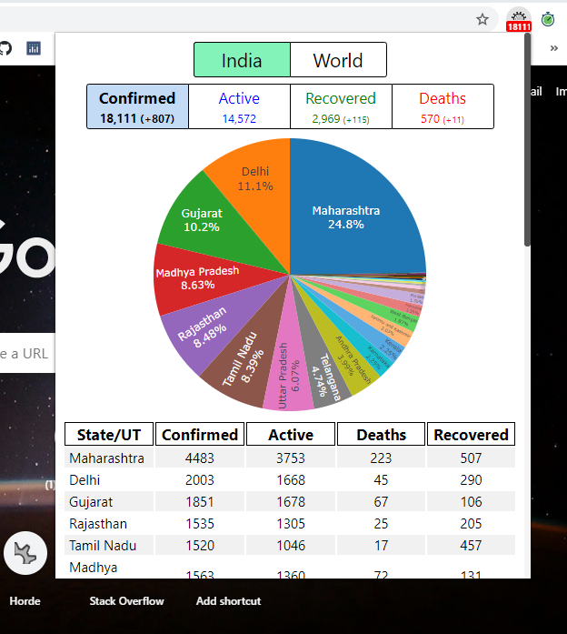

## COVID-19 Tracker
_A chrome/firefox extension to quickly track the latest statistics regarding the Coronavirus disease._

  

This extension uses real time statistics from worldmeters (API: <a href='https://covid19-docs.chrismichael.now.sh/'>https://covid19-docs.chrismichael.now.sh/</a> ) and data from <a href='https://www.covid19india.org'>https://www.covid19india.org</a>  (API: <a href='https://api.covid19india.org/'>https://api.covid19india.org/</a> ) to show coronavirus statistics for India and Worldwide. Current confimed cases in India is shown on extension badge.  

## Installation
### Chrome
The extension is not available is chrome webstore (Sorry didn't want to pay $5). So, you have to use this in developer mode. Download this repo then,   
Go to <a href='chrome://extensions'>chrome://extensions</a>  > Enable developer mode > 
Load unpack extension > load this repo folder.  

### Firefox
Go to <a href='about:debugging#/runtime/this-firefox'>about:debugging#/runtime/this-firefox</a> > Load Temporary Add-on... > Load the `manifest.json`

## Project Link
<a href='https://github.com/Koushikphy/COVID19-Browser-Extension'>https://github.com/Koushikphy/COVID19-Browser-Extension</a>